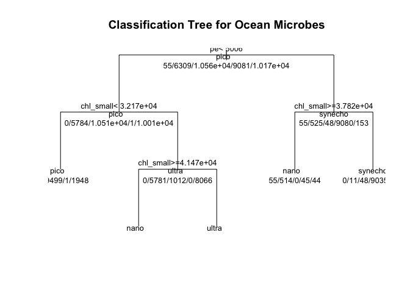

Ocean Microbes Classification with Decision Tree, Random Forest & SVM
================
Dhanashree Pokale
4/18/2017

This dataset contains a 21 minute sample from the vessel in a file seaflow\_21min.csv. It is pre-processed to remove the calibration "beads" that are passed from the the system for monitoring, long with some other particle types.

``` r
local({r <- getOption("repos");         
r["CRAN"] <- "http://cran.r-project.org"; options(repos=r)})
```

The columns of this dataset are as follows:

1.  file\_id: The data arrives in files, where each file represents a three-minute window; this field represents which file the data came from. The number is ordered by time, but is otherwise not significant.
2.  time: This is an integer representing the time the particle passed through the instrument. Many particles may arrive at the same time; time is not a key for this relation.
3.  cell\_id: A unique identifier for each cell WITHIN a file. (file\_id, cell\_id) is a key for this relation.
4.  d1, d2: Intensity of light at the two main sensors, oriented perpendicularly. These sensors are primarily used to determine whether the particles are properly centered in the stream. Used primarily in preprocesssing; they are unlikely to be useful for classification.
5.  fsc\_small, fsc\_perp, fsc\_big: Forward scatter small, perpendicular, and big. These values help distingish different sizes of particles.
6.  pe: A measurement of phycoerythrin fluorescence, which is related to the wavelength associated with an orange color in microorganisms
7.  chl\_small, chl\_big: Measurements related to the wavelength of light corresponding to chlorophyll.
8.  pop: This is the class label assigned by the clustering mechanism used in the production system.

It can be considered "ground truth" for the purposes of the assignment, but note that there are particles that cannot be unambiguously classified, so you should not aim for 100% accuracy. The values in this column are crypto, nano, pico, synecho, and ultra

##### Read and Summarize Data

``` r
#Read Dataset####
myfile <- read.csv('https://raw.githubusercontent.com/uwescience/datasci_course_materials/master/assignment5/seaflow_21min.csv', header = TRUE, sep=',')
```

``` r
#Summarize Dataset####
summary(myfile)
```

    ##     file_id           time          cell_id            d1       
    ##  Min.   :203.0   Min.   : 12.0   Min.   :    0   Min.   : 1328  
    ##  1st Qu.:204.0   1st Qu.:174.0   1st Qu.: 7486   1st Qu.: 7296  
    ##  Median :206.0   Median :362.0   Median :14995   Median :17728  
    ##  Mean   :206.2   Mean   :341.5   Mean   :15008   Mean   :17039  
    ##  3rd Qu.:208.0   3rd Qu.:503.0   3rd Qu.:22401   3rd Qu.:24512  
    ##  Max.   :209.0   Max.   :643.0   Max.   :32081   Max.   :54048  
    ##        d2          fsc_small        fsc_perp        fsc_big     
    ##  Min.   :   32   Min.   :10005   Min.   :    0   Min.   :32384  
    ##  1st Qu.: 9584   1st Qu.:31341   1st Qu.:13496   1st Qu.:32400  
    ##  Median :18512   Median :35483   Median :18069   Median :32400  
    ##  Mean   :17437   Mean   :34919   Mean   :17646   Mean   :32405  
    ##  3rd Qu.:24656   3rd Qu.:39184   3rd Qu.:22243   3rd Qu.:32416  
    ##  Max.   :54688   Max.   :65424   Max.   :63456   Max.   :32464  
    ##        pe          chl_small        chl_big           pop       
    ##  Min.   :    0   Min.   : 3485   Min.   :    0   crypto :  102  
    ##  1st Qu.: 1635   1st Qu.:22525   1st Qu.: 2800   nano   :12698  
    ##  Median : 2421   Median :30512   Median : 7744   pico   :20860  
    ##  Mean   : 5325   Mean   :30164   Mean   : 8328   synecho:18146  
    ##  3rd Qu.: 5854   3rd Qu.:38299   3rd Qu.:12880   ultra  :20537  
    ##  Max.   :58675   Max.   :64832   Max.   :57184

##### Sampling dataset

We split the dataset into two equal subsets- -one for training -one for testing

``` r
#Subset Dataset####
set.seed(108685665)
subset_indices = sample(nrow(myfile),nrow(myfile)*0.50)
ocean_train = myfile[subset_indices,]
ocean_test = myfile[-subset_indices,]
```

##### Mean of the time in training dataset

``` r
#Find mean of time in ocean training dataset####
mean(ocean_train$time)
```

    ## [1] 342.0303

##### Plot the graphs to check pe against chl\_small and color by pop relationships

``` r
library(ggplot2)
qplot(pe, chl_small, data=ocean_train, geom=c("point", "smooth"), color = pop, main="chl_small per pe",
      xlab="pe", ylab="chl_small")
```

    ## `geom_smooth()` using method = 'gam'


``` r
# observations (points) are overlayed and jittered
hist(myfile$fsc_big)
```


``` r
hist(myfile$chl_big)
```


``` r
hist(myfile$fsc_perp)
```


``` r
hist(myfile$chl_small)
```


``` r
hist(myfile$fsc_small)
```

 \#\#\#\#\# Decision Tree modeling

``` r
#Train a Decision Tree####
library(rpart)
fol <- formula(pop ~ fsc_small + fsc_perp + fsc_big + pe + chl_big + chl_small)
model <- rpart(fol, method="class", data=ocean_train)
print(model)  
```

    ## n= 36171 
    ## 
    ## node), split, n, loss, yval, (yprob)
    ##       * denotes terminal node
    ## 
    ##  1) root 36171 25612 pico (0.0015 0.17 0.29 0.25 0.28)  
    ##    2) pe< 5006.5 26310 15799 pico (0 0.22 0.4 3.8e-05 0.38)  
    ##      4) chl_small< 32166.5 11451  1952 pico (0 0.00026 0.83 8.7e-05 0.17) *
    ##      5) chl_small>=32166.5 14859  6793 ultra (0 0.39 0.068 0 0.54)  
    ##       10) chl_small>=41468 4960   568 nano (0 0.89 0 0 0.11) *
    ##       11) chl_small< 41468 9899  2401 ultra (0 0.14 0.1 0 0.76) *
    ##    3) pe>=5006.5 9861   781 synecho (0.0056 0.053 0.0049 0.92 0.016)  
    ##      6) chl_small>=37823 658   144 nano (0.084 0.78 0 0.068 0.067) *
    ##      7) chl_small< 37823 9203   168 synecho (0 0.0012 0.0052 0.98 0.012) *

``` r
plot(model, uniform=TRUE, 
     main="Classification Tree for Ocean Microbes")
text(model, use.n=TRUE, all=TRUE, cex=.8)
```



##### Prediction using Decision tree modeling

``` r
#Predict using decision tree model####
pred <- predict(model, newdata=ocean_test,type="class")
table(ocean_test$pop, pred)
```

    ##          pred
    ##           crypto nano pico synecho ultra
    ##   crypto       0   47    0       0     0
    ##   nano         0 4956    1      10  1422
    ##   pico         0    1 9337      44   919
    ##   synecho      0   44    4    9017     0
    ##   ultra        0  649 1948      87  7686

``` r
mean(ocean_test$pop==pred)
```

    ## [1] 0.8569059

##### Random Forest modeling

``` r
#Random Forest####
library(randomForest) 
```

    ## randomForest 4.6-12

    ## Type rfNews() to see new features/changes/bug fixes.

    ## 
    ## Attaching package: 'randomForest'

    ## The following object is masked from 'package:ggplot2':
    ## 
    ##     margin

``` r
model <- randomForest(fol, data=ocean_train)
importance(model)
```

    ##           MeanDecreaseGini
    ## fsc_small        2685.1245
    ## fsc_perp         2024.8371
    ## fsc_big           202.4631
    ## pe               8881.1362
    ## chl_big          4958.7564
    ## chl_small        8092.8451

Random forests have the ability to generate an estimate of variable importance while training by rearranging the values in a particular variable & measuring its effect on classification. If the change of values has very less effect on the model's ability to make predictions, then we conclude that variable may not be that important.

RF can have another estimate of variable importance based on the Gini impurity. Importance(model) function returns the mean decrease in Gini importance for every variable. The bigger the number, the more the Gini impurity score decreases by branching on this variable, suggesting that the variable is more important.

##### Prediction using Random Forest modeling

``` r
#Predict using RF model####
pred <- predict(model, newdata=ocean_test,type="class")
table(ocean_test$pop, pred)
```

    ##          pred
    ##           crypto nano pico synecho ultra
    ##   crypto      47    0    0       0     0
    ##   nano         3 5593    0       6   787
    ##   pico         0    0 9979      16   306
    ##   synecho      1    1    1    9062     0
    ##   ultra        0  379 1382       7  8602

``` r
mean(ocean_test$pop==pred)
```

    ## [1] 0.9201316

##### Support Vector Machine Modeling

``` r
#Train model using support vector machine####
library(e1071)
model <- svm(fol, data=ocean_train)
```

##### Predicting using SVM Model

``` r
#Predict using SVM model####
pred <- predict(model, newdata=ocean_test,type="class")
table(ocean_test$pop, pred)
```

    ##          pred
    ##           crypto nano pico synecho ultra
    ##   crypto      43    0    0       4     0
    ##   nano         0 5654    0       8   727
    ##   pico         0    0 9959      56   286
    ##   synecho      0    0   26    9035     4
    ##   ultra        0  440 1391       5  8534

``` r
mean(ocean_test$pop==pred)
```

    ## [1] 0.9185281

##### Performing checks to verify results

``` r
#Sanity Check####
qplot(time, chl_big, data=ocean_train, geom=c("point", "smooth"), color = pop, main="chl_small per pe",
      xlab="time", ylab="chl_big")
```

    ## `geom_smooth()` using method = 'gam'


``` r
# Remove file 208
mynewfile <-  subset(myfile, myfile$file_id != "208")
nrow(mynewfile)
```

    ## [1] 60348

##### After removing corrupt data rows; rerun models

``` r
#Subset Dataset####
set.seed(108685665)
subset_new_indices = sample(nrow(mynewfile),nrow(mynewfile)*0.50)
ocean_new_train = mynewfile[subset_new_indices,]
ocean_new_test = mynewfile[-subset_new_indices,]

#Train model using support vector machine####
library(e1071)
model_new <- svm(fol, data=ocean_new_train)

#Predict using SVM model####
prednew <- predict(model_new, newdata=ocean_new_test,type="class")
table(ocean_new_test$pop, prednew)
```

    ##          prednew
    ##           crypto nano pico synecho ultra
    ##   crypto      40    2    0       1     0
    ##   nano         2 4633    0       0   181
    ##   pico         0    0 9825      56   176
    ##   synecho      0    5   30    6955     0
    ##   ultra        0  217  198       7  7846

``` r
mean(ocean_new_test$pop==prednew)
```

    ## [1] 0.9710015

``` r
# net improvement in accuracy####
x <- mean(ocean_new_test$pop==prednew) - mean(ocean_test$pop==pred)
x
```

    ## [1] 0.05247338
